# Execution Plan - 테이블오더 서비스

## Detailed Analysis Summary

### Change Impact Assessment
- **User-facing changes**: Yes — 고객용 태블릿 주문 UI + 관리자 대시보드 전체 신규 구축
- **Structural changes**: Yes — 전체 시스템 아키텍처 신규 설계 (Backend + Frontend + DB)
- **Data model changes**: Yes — 10개 이상의 엔티티 신규 설계 필요
- **API changes**: Yes — REST API 전체 신규 설계 (고객용 + 관리자용)
- **NFR impact**: Yes — 분당 500건+ 처리, 100개+ 테이블, SSE 실시간 통신, JWT 인증, Security Extension

### Risk Assessment
- **Risk Level**: Medium-High
- **Rollback Complexity**: Easy (Greenfield — 기존 시스템 없음)
- **Testing Complexity**: Complex (실시간 통신, 역할 기반 인증, 대규모 동시 처리)

---

## Workflow Visualization

```mermaid
flowchart TD
    Start(["User Request"])
    
    subgraph INCEPTION["INCEPTION PHASE"]
        WD["Workspace Detection<br/>COMPLETED"]
        RA["Requirements Analysis<br/>COMPLETED"]
        US["User Stories<br/>COMPLETED"]
        WP["Workflow Planning<br/>COMPLETED"]
        AD["Application Design<br/>EXECUTE"]
        UG["Units Generation<br/>EXECUTE"]
    end
    
    subgraph CONSTRUCTION["CONSTRUCTION PHASE"]
        FD["Functional Design<br/>EXECUTE"]
        NFRA["NFR Requirements<br/>EXECUTE"]
        NFRD["NFR Design<br/>EXECUTE"]
        CG["Code Generation<br/>EXECUTE"]
        BT["Build and Test<br/>EXECUTE"]
    end
    
    Start --> WD
    WD --> RA
    RA --> US
    US --> WP
    WP --> AD
    AD --> UG
    UG --> FD
    FD --> NFRA
    NFRA --> NFRD
    NFRD --> CG
    CG --> BT
    BT --> End(["Complete"])
    
    style WD fill:#4CAF50,stroke:#1B5E20,stroke-width:3px,color:#fff
    style RA fill:#4CAF50,stroke:#1B5E20,stroke-width:3px,color:#fff
    style US fill:#4CAF50,stroke:#1B5E20,stroke-width:3px,color:#fff
    style WP fill:#4CAF50,stroke:#1B5E20,stroke-width:3px,color:#fff
    style AD fill:#FFA726,stroke:#E65100,stroke-width:3px,stroke-dasharray: 5 5,color:#000
    style UG fill:#FFA726,stroke:#E65100,stroke-width:3px,stroke-dasharray: 5 5,color:#000
    style FD fill:#FFA726,stroke:#E65100,stroke-width:3px,stroke-dasharray: 5 5,color:#000
    style NFRA fill:#FFA726,stroke:#E65100,stroke-width:3px,stroke-dasharray: 5 5,color:#000
    style NFRD fill:#FFA726,stroke:#E65100,stroke-width:3px,stroke-dasharray: 5 5,color:#000
    style CG fill:#4CAF50,stroke:#1B5E20,stroke-width:3px,color:#fff
    style BT fill:#4CAF50,stroke:#1B5E20,stroke-width:3px,color:#fff
    style Start fill:#CE93D8,stroke:#6A1B9A,stroke-width:3px,color:#000
    style End fill:#CE93D8,stroke:#6A1B9A,stroke-width:3px,color:#000
    style INCEPTION fill:#BBDEFB,stroke:#1565C0,stroke-width:3px,color:#000
    style CONSTRUCTION fill:#C8E6C9,stroke:#2E7D32,stroke-width:3px,color:#000
    linkStyle default stroke:#333,stroke-width:2px
```



### Text Alternative
```
Phase 1: INCEPTION
  - Workspace Detection (COMPLETED)
  - Requirements Analysis (COMPLETED)
  - User Stories (COMPLETED)
  - Workflow Planning (COMPLETED)
  - Application Design (EXECUTE)
  - Units Generation (EXECUTE)

Phase 2: CONSTRUCTION
  - Functional Design (EXECUTE)
  - NFR Requirements (EXECUTE)
  - NFR Design (EXECUTE)
  - Infrastructure Design (SKIP)
  - Code Generation (EXECUTE)
  - Build and Test (EXECUTE)
```

---

## Phases to Execute

### INCEPTION PHASE
- [x] Workspace Detection (COMPLETED)
- [x] Reverse Engineering (SKIPPED — Greenfield)
- [x] Requirements Analysis (COMPLETED)
- [x] User Stories (COMPLETED)
- [x] Workflow Planning (IN PROGRESS)
- [ ] Application Design — **EXECUTE**
  - **Rationale**: 신규 프로젝트로 컴포넌트 식별, 서비스 레이어 설계, 컴포넌트 간 의존성 정의가 필요
- [ ] Units Generation — **EXECUTE**
  - **Rationale**: Backend + Frontend + DB 등 다수의 유닛으로 분해하여 체계적 구현 필요

### CONSTRUCTION PHASE (Per-Unit)
- [ ] Functional Design — **EXECUTE**
  - **Rationale**: 10개+ 엔티티의 데이터 모델, 비즈니스 규칙(주문 상태 흐름, 세션 라이프사이클), API 설계 필요
- [ ] NFR Requirements — **EXECUTE**
  - **Rationale**: 분당 500건+ 처리, 100개+ 테이블, SSE 실시간 통신, JWT 인증, Security Extension 전체 적용
- [ ] NFR Design — **EXECUTE**
  - **Rationale**: NFR Requirements에서 도출된 패턴을 구체적 설계에 반영 필요
- [ ] Infrastructure Design — **SKIP**
  - **Rationale**: AWS 배포 계획이 있으나 MVP 단계에서는 코드 구현에 집중. 인프라 설계는 추후 별도 진행 가능
- [ ] Code Generation — **EXECUTE** (ALWAYS)
  - **Rationale**: 실제 코드 구현 필수
- [ ] Build and Test — **EXECUTE** (ALWAYS)
  - **Rationale**: 빌드 및 테스트 검증 필수

### OPERATIONS PHASE
- [ ] Operations — **PLACEHOLDER**
  - **Rationale**: 향후 배포/모니터링 워크플로우 확장 예정

---

## Success Criteria
- **Primary Goal**: 고객이 태블릿에서 메뉴 조회/주문하고, 관리자가 실시간으로 주문을 모니터링/관리할 수 있는 MVP 시스템 구축
- **Key Deliverables**:
  - Spring Boot Backend API 서버
  - React TypeScript Frontend (고객용 + 관리자용)
  - PostgreSQL 데이터베이스 스키마
  - SSE 기반 실시간 주문 알림
  - JWT 기반 인증/인가 (역할별 권한)
  - S3 이미지 업로드
  - 단위 테스트
- **Quality Gates**:
  - 모든 API 엔드포인트 동작 확인
  - 역할 기반 접근 제어 검증
  - SSE 실시간 알림 2초 이내 전달 확인
  - Security Extension 규칙 준수 확인

---
